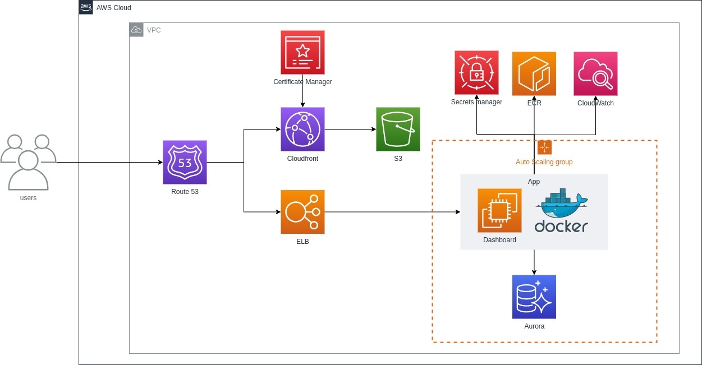

# Shortener url

Shortener url is system to shortener url.

## AWS architecture



## Overview

The software consists:

* CRUD to User (with authentication) and shortener url write in Ruby on Rails 6.

### Dependencies

* Ruby  version
  * 3.0.1, see [ruby version](.ruby-version)

* System dependencies
  * All dependencies are available at [Gemfile](Gemfile).

### To run

* Local

    ```sh
    $ bundle install
    $ rails s
    ```

* Docker-compose

    ```sh
    $ docker-compose up --build
    ```

* Docker hub

    ```sh
    $ docker pull danilovbarbosa/test-shortner-url:0.1.0
    $ docker run -it -p 80:3000 --name test-shortner-url danilovbarbosa/test-shortner-url:0.1.0
    ```

* Database creation

    ```sh
    $ rails db:create
    $ rails db:migrate
    $ rails db:seed
    ```

* How to run the test suite

    * Rspec (model, controller, ...)

        ```sh
        $ rspec
        ```

